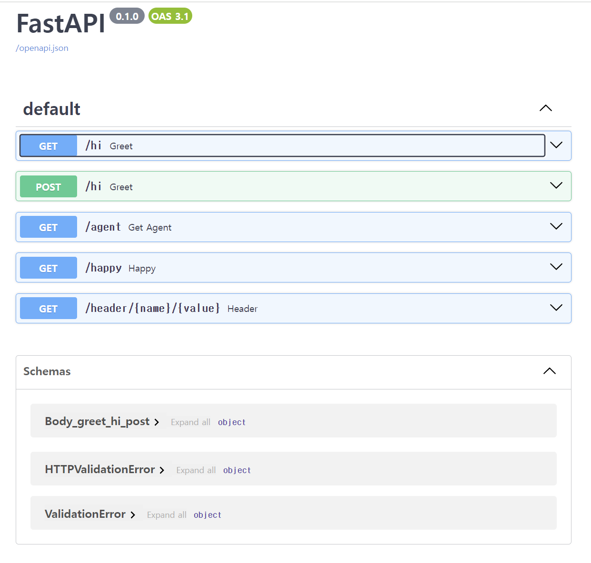

# 8 / 27

## 서버 실행

- **uvicorn 파이썬파일이름:app**
---
## 3. FastAPI 둘러보기

### 3.1 FastAPI 소개

- FastAPI 장점

  - 성능 : 특정한 경우에서 Node.js와 Go에 견줄 만하다.
  - 빠른 개발 : 이해하기 어렵거나 이상한 부분이 없다
  - 향상된 코드 품질 : 버그 줄일 때 유용
  - 자동 생성된 문서 및 테스트 페이지 : OpenAPI 설명을 직접 편집하는 것보다 훨씬 더 쉽다

- FastAPI 주로 사용하는 기능

  - 파이썬 타입 힌트
  - 비동기 지원을 포함한 웹 머신용 Starlette
  - 데이터 정의 및 유효성 검사를 위한 Pydantic
  - 다른 기능을 활용하고 확장할 수 있는 특별한 통합 기능
---
### 3.2 FastAPI 실행 방법

- FastAPI 프레임워크 : pip install fastapi
- Uvicorn 웹 서버 : pip install uvicorn
- pip install httpie
- pip install requests
- pip install httpx
---
### 3.4

- FastAPI는 200 상태 코드를 반환한다.
  - > 예외일 경우 : 4xx 반환
---
### 3.5 자동 문서화

<!-- http://localhost:8000/docs/ -->

---
## 4. Starlette과 비동기, 동시성

### 4.2 동시성 유형

- 병렬 컴퓨팅 : 하나의 작업을 여러 개의 전용 CPU에 동시에 분산한다.
  - 사용 예시
    - 화면구현
    - 머신러닝

- 동시 컴퓨팅 : 각 CPU가 여러 작업을 전환한다.
---
## 5. Pydantic과 타입 힌트, 모델

- 서버 시작 : **uvicorn web:app --reload**
- 서버 재시작 : **uvicorn web:app**
---
### 5.4 간단한 예

- model.py : Pydantic 모델을 정의한다
- data.py : 모델의 인스턴스를 정의하는 가짜 데이터 소스다
- web.py : 가짜 데이터를 반환하는 FastAPI 웹 엔드포인트를 정의한다.
---
### 5.7 정리

- 모델 : 웹 애플리케이션에서 전달할 데이터를 저의하는 가장 좋은 방법
- Pydantic : 파이썬의 타입 힌트를 활ㅇㅇ해 애플리케이션에서 전달할 데이터 모델을 정의
---
## 6. 의존성

### 6.1 의존성이란?

- 어떤 시점에 필요한 특정 정보
---

### 6.2 의존성 관련 문제

- 테스트 : 의존성을 다른 방식으로 얻을 수 없어, 테스트를 위해 함수를 변형할 수 없다.
- 숨겨진 의존성 : 세부 사항을 숨기면 외부 코드가 변경될 때 우리가 작성한 코드가 망가질 수 있다
- 중복 호출 : 데이터베이스에서 사용자를 조회하거나 HTTP 요청 값을 결합하는 등 의조성이 공통으로 사용되면 여러 함수에서 중복으로 호출될 수 있다.
- OpenAPI 가시성: FastAPI가 생성하는 자동화된 API 문서는 의존성 주이 메커니즘에 대한 정보가 필요하다.

---

### 6.3 의존성 주입

- 필요한 특정 정보를 함수에 전달
- 헬퍼 함수를 전달 > 호출하여 특정 데이터를 가져온다.
---

## 7. 프레임워크 비교
---
### 7.1 Flask

- 기본 뼈대를 제공하고 필요에 따라 서드파티 패키지를 다운로드해 보완한다.
- Django 보다 작고 처음 시작할 때 더 빨리 배울 수 있다.

- **근데 가상환경에서 해야하는 것 같다. 지금은 바쁘니까 넘어갈 것이다.**

---
### 7.2. Django

- ORM은 주요 데이터베이스를 백엔드로 사용하는 웹사이트에 유용하다.
---
### 정리

- 파이썬의 3대 웹 프레임워크
  - Flask
  - Django
  - FastAPI
---